# Grocery List App

## Description
GroceryListManager is a grocery cart application for Android designed to help track items in a grocery list made by the user.  It will contain a database back-end of Grocery Store items and item-types and a front end developed in Android Studio. The main functionality will allow for users to add item-quantities to a grocery list, create new items, edit item quantities on the list, check items off the list, and clear the list of all check-offs.

### System Environment

*Platform: Android SDK

*Operating Systems: Android SDK 24 compatible

*User Environment: Android Phone app

## User Interface 

###Main Screen / List of Available GroceryLists
Upon opening the app, the user is presented with a home screen that contains a list of all saved grocery lists, sorted by last updated time. This screen allows the user to add, open or delete grocery lists.

**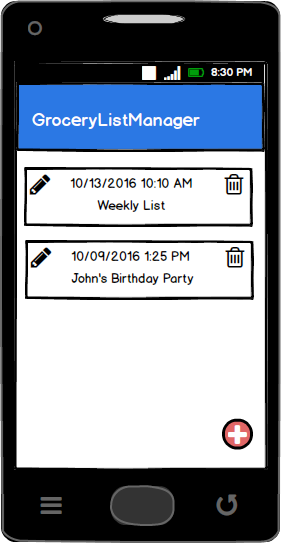**

###Add/Edit-Grocery Lists
To add a new grocery list, the user clicks on the floating action button in the bottom right corner. A dialogue box appears, prompting the user to enter a valid list name, which may contain alphanumeric characters, spaces, and parentheses. Clicking Save returns the user to the home screen with the newly added empty list. From there, the user may click on the Edit pencil icon to open the list, add items, and/or rename the list.

**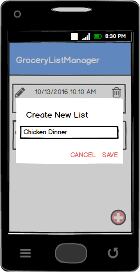**

**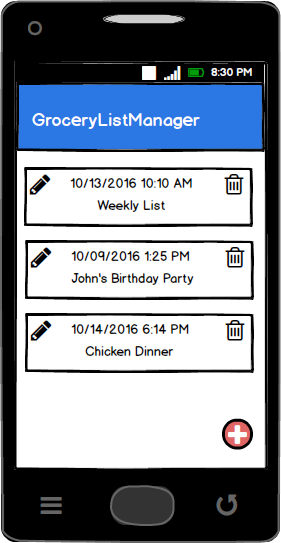**

###Add-Items
To add items to a list, the user clicks on the plus icon in the top menu.

**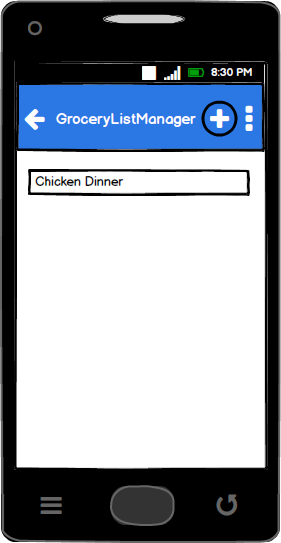**

This loads an Add Item dialogue box that contains a pre-filled Category dropdown and an autocomplete text for the name of the item. The user may select an item from the autocomplete suggestions or type a new item name. The field only accepts alphanumeric characters, spaces, and parentheses, and contains a 100 character max. If the category dropdown or the item name fields are empty, the "Add" button is disabled.

**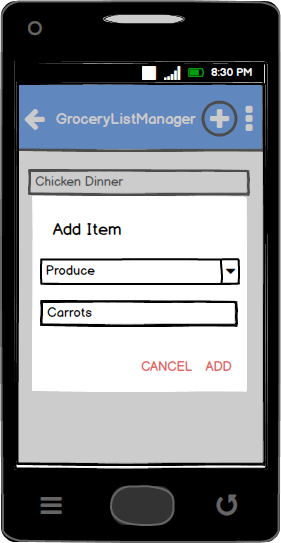**

The Add button automatically saves the new item to the list, defaulting the quantity and unit of measure to "1 each", which can later be editted.

**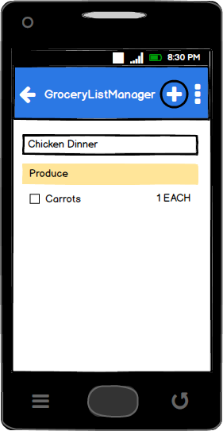**

###Multiple Categories
To facilitate finding items in the grocery store more easily, the items are grouped by category in the list.

**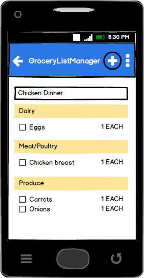**

###Edit-Items
To edit the unit of measure and/or quantity of an item, the user must select the item by performing a long-click. This presents the user with a menu containing Edit and Delete options. 

****

Clicking Edit opens a dialogue box where the user may select the quantity and/or units of measure. Clicking Save automatically saves these changes to the list.

**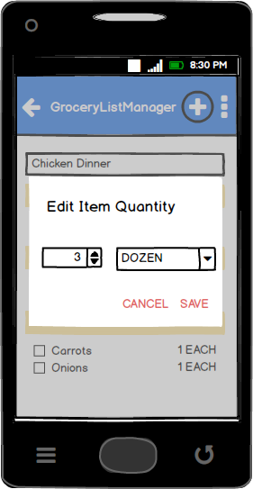**

###Checking / Resetting Boxes
The app automatically saves the users actions when checking and unchecking boxes. If a user wants to re-use a checklist, the user may easily uncheck all the boxes by selecting the Reset option in the top menu.

**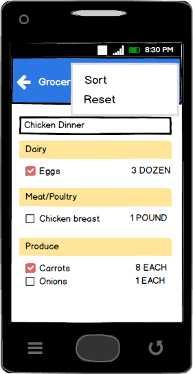**

**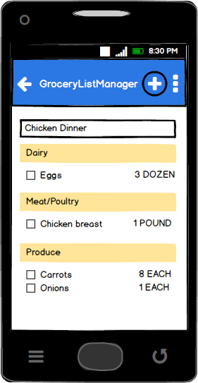**

###Delete Item
To delete an item from the checklist, the user can perform a long-click and select Delete from the resulting menu. On selection, the user is asked to confirm whether or not to delete the item. 

**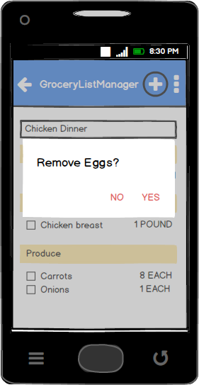**

## Authors
Matt Morton
Xi Liu
Raymond Yeh
